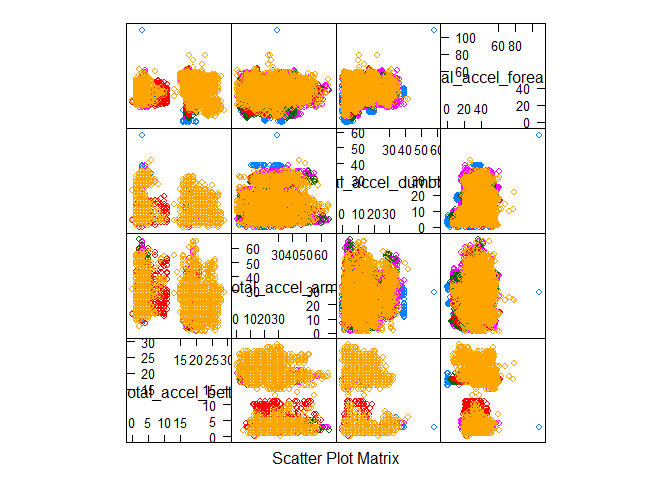
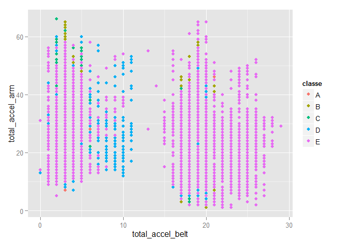
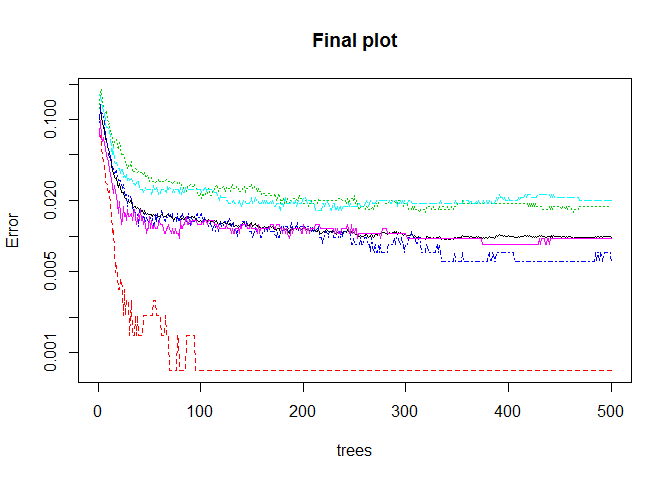

# pml_analysis.RMD
Kaushank  
Friday, February 13, 2015  

<b>Analysis of Weight Lifting Exercises Dataset</b>

Synopsis

Using devices such as Jawbone Up, Nike FuelBand, and Fitbit it is now possible to collect a large amount of data about personal activity relatively inexpensively. These type of devices are part of the quantified self movement - a group of enthusiasts who take measurements about themselves regularly to improve their health, to find patterns in their behavior.

<H2>Building The Prediction Model</H2>
<H3>The Problem Statement(Question)</H3>

The goal of this project is to predict the manner in which they did the exercise. 
<H3>Data</H3>

 Training data: https://d396qusza40orc.cloudfront.net/predmachlearn/pml-training.csv

Test data : https://d396qusza40orc.cloudfront.net/predmachlearn/pml-testing.csv

Steps Involved:

<h3>Load Libraries and data</h3>


```r
library(ggplot2)
```

```
## Warning: package 'ggplot2' was built under R version 3.1.2
```

```r
library(lattice)
```

```
## Warning: package 'lattice' was built under R version 3.1.2
```

```r
library(caret)
```

```
## Warning: package 'caret' was built under R version 3.1.2
```

```r
training<-read.csv('pml-training.csv',header=T)
testing<-read.csv('pml-testing.csv',header=T)
```
Data will be preprocessed to remove many redundant attributes and to explore only those attributes needed to answer questions meaningfully. 

<b>Steps:</b>
1.Remove the columns that contain NA
2. Remove all the predictors which contain factors except for the classe predictor which is the label for the training data set
3. Build a validation data set using a very small portion of the training data set
using only 5000 samples from the training data set,


```r
set.seed(32323)
training<-training[,colSums(is.na(training)) == 0]
i1 <- sapply(training,function(x)is.factor(x)&&length(levels(x))!=5)
training<-training[,!i1]
training<-training[,4:57]

testing<-testing[,colSums(is.na(testing)) == 0]
i1 <- sapply(testing,function(x)is.factor(x)&&length(levels(x))!=5)
testing<-testing[,!i1]
testing<-testing[4:57]

trainInds <- sample(nrow(training), 5000)
train <- training[trainInds,]
validationParent<-training[-trainInds,]
validInds <- sample(nrow(validationParent), 1000)
validation<- validationParent[validInds,]
```

<H2>Exploratory Data plots</H2>

A plot is generated using the total values present within the data set
showing the various variable plotted against each other


```r
featurePlot(x=training[,c("total_accel_belt","total_accel_arm","total_accel_dumbbell","total_accel_forearm")],y=training$classe,plot="pairs")
```

 

```r
qplot(total_accel_belt,total_accel_arm,colour=classe,data=training)
```

 

<b>Training the data</b>
The next process involves training the data set using the random forests approach  with only a very small subset to train followed by cross validation.
The Model is then appied to the test data set followed by final plot


```r
modFit<-train(classe~ .,data=train,method="rf",proxy=T)
```

```
## Loading required package: randomForest
```

```
## Warning: package 'randomForest' was built under R version 3.1.2
```

```
## randomForest 4.6-10
## Type rfNews() to see new features/changes/bug fixes.
```

```r
predictionValidation<-predict(modFit,validation)
table(predictionValidation,validation$classe)
```

```
##                     
## predictionValidation   A   B   C   D   E
##                    A 289   2   0   0   0
##                    B   0 184   4   0   0
##                    C   0   2 162   1   0
##                    D   0   0   0 163   0
##                    E   0   0   0   0 193
```

```r
prediction<-predict(modFit,testing)
table(1:20,prediction)
```

```
##     prediction
##      A B C D E
##   1  0 1 0 0 0
##   2  1 0 0 0 0
##   3  1 0 0 0 0
##   4  1 0 0 0 0
##   5  1 0 0 0 0
##   6  0 0 0 0 1
##   7  0 0 0 1 0
##   8  0 1 0 0 0
##   9  1 0 0 0 0
##   10 1 0 0 0 0
##   11 0 1 0 0 0
##   12 0 0 1 0 0
##   13 0 1 0 0 0
##   14 1 0 0 0 0
##   15 0 0 0 0 1
##   16 0 0 0 0 1
##   17 1 0 0 0 0
##   18 0 1 0 0 0
##   19 0 1 0 0 0
##   20 0 1 0 0 0
```

```r
plot(modFit$finalModel,log="y",main="Final plot")
```

 
